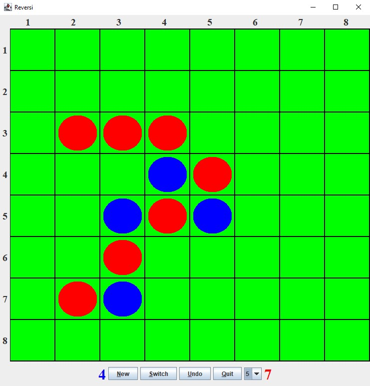
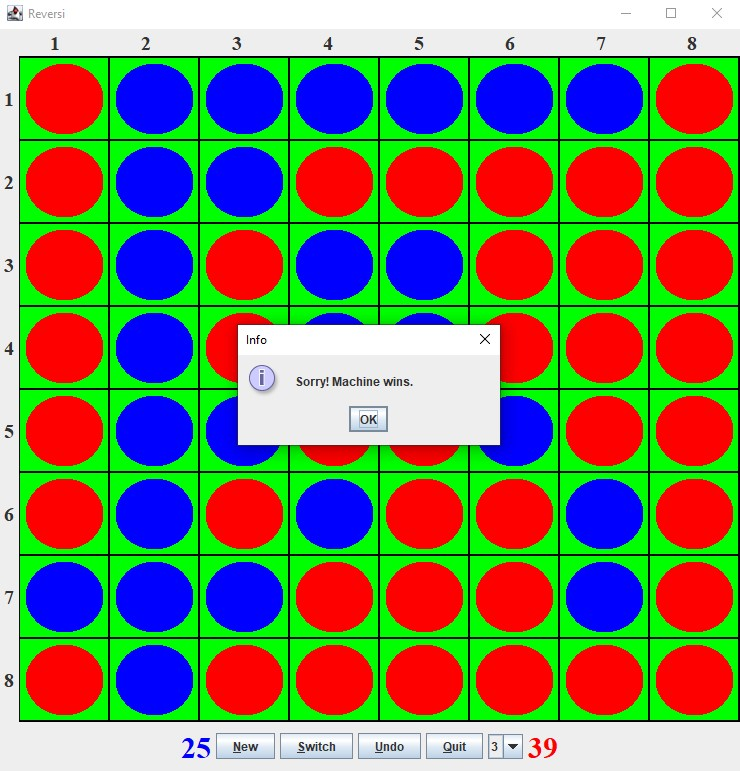

# Reversi (Java, MVC)

This project is an implementation of the classic board game Reversi (Othello) in Java.  
The main goal was to design a clean separation between game logic and user interface using the MVC architecture.

## Features

- Classic Reversi gameplay against an AI opponent
- Full implementation of game rules including valid moves and piece flipping
- Graphical user interface built with Java Swing
- Clear separation of Model, View, and Controller
- Structured and maintainable codebase

## Screenshots

### Game Board

  

### AI wins the game

  

## AI Opponent

The game includes an AI opponent based on a decision tree approach.

- The AI evaluates all possible moves by analyzing the current board state  
- Each possible board state is assigned a score based on a heuristic evaluation (computes up to 5 moves ahead)
- The move with the highest score is selected  

The lookahead depth can be configured, allowing the AI to simulate multiple future board states and make more strategic 
decisions.

## Architecture

The project follows the MVC (Model-View-Controller) pattern:

- **Model**: Contains the game logic and state as well as the AI decision tree implementation
- **View**: Implements the graphical user interface using Java Swing  
- **Controller**: Handles user input and controls the game flow  

The goal was to keep these components as independent as possible.

## Technologies

- Java  
- Java Swing (GUI)  
- MVC architecture  

## Learning Objectives

- Applying object-oriented programming principles  
- Implementing a common design pattern (MVC)  
- Separating business logic from UI  
- Structuring a medium-sized project  

## How to Run

### Requirements

- Java (JDK 17 or higher)

### Run the Application
Run the main method located in the Shell class

## Note

This project was developed as part of a university course.